# Certificate Authority Lab

---

## Introduction
The objective of this lab was to build a functional public key infrastructure environment to understand encrypted web traffic. This will involve me deploying a primary Ubuntu server to act as a local certificate authority and a second Ubuntu server to act as our Apache web server. By generating keys and certificate signing requests and signing them from our primary Ubuntu server this lab will demonstrate how digital trust is establishe. I will also cover the configuration of secure web protocols (HTTPS) and the critical process of certificate revocation to simulate the complete certificate life cycle.

---

## Part 1: Setup and Ubuntu Server Overview

**What is Ubuntu Server?** Ubuntu server is a customizable and open source Linux operating system designed to host enterprise level services web applications and network infrastructure without the overhead of a graphical user interface like you see on a standard windows or linux OS.

**What does it do?** Ubuntu server provides a stable and secure foundation for deploying services like Apache web servers, databases SHSSH gateways and as I will attempt to demonstrate in this lab a secure certificate authority. It handles the network routing file management and service hosting through a simple bash CLI. 

**What is the product's history?** Ubuntu was released in 2004, Ubntu and other Linux operating systems were built on the Debian architecture and the specific model I'm using today which is the 24.04 version is a long term support version which guarantees five years of security updates.

**What is the difference between the desktop and server versions?** There are a lot of differences between the desktop and server versions of Ubuntu and the primary difference is the user interface and the default installed packages the desktop version includes A graphical user interface and consumer applications like web browsers an office suites whereas Ubuntu server defaults to a headless command line interface and comes prepackaged with server oriented software like openSSH (If selected druing setup) and virtualization tools to optimize the system resources.

**Installation Experience & Troubleshooting:** The installation experience with Ubuntu as as simple as it can get. It is a tad bit more complicated than setting up the version with a user interface because the entire setup is done through the command line but with the ability to follow the commands given to you it is really simple to set up even without a fancy user interface.

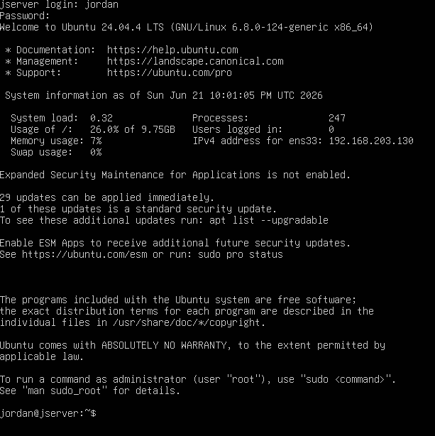
*Figure 1: The screen you get from a fully configured Ubuntu Machine*

---

## Part 2: VM Cloning

**Why would you make a clone of a VM?** Cloning a virtual machine allows the user to instantly duplicate a fully configured operating system allowing for time saving in this instance. It is used to rapidly scale infrastructure in a corporate environment and create safe testing environments or even to deploy multiple servers that require the same baseline software without sitting through the entire operating system installation process repeatedly (such as I do in this lab).

**What are the advantages/disadvantages compared to building a VM from scratch?** There are advantages and disadvantages to building a virtual machine are significant. When building a virtual machine from scratch you have more customization options for a specific machine such as whether you wanted openSSH on this server or you didn't want it by default. In this case whenever I cloned my virtual machine I actually did experience issues since they were booted on the same network it caused an IP address conflict where both cloned machines had the same exact IP address which had to be fixed in the advanced section of the network tab. A full clone can definitely have its advantages though as long as you know what you're doing.

**Which approach do you prefer and why?** I personally prefer cloning for my lab environments because it maximizes my efficiency the time that I save by not having to run operating system updates and basic configurations far outweighs the minor inconvenience of manually regenerating a network adapter MAC address like I had to do.

**Cloning Experience & Troubleshooting:** The cloning process is relatively simple the only issue you may face with cloning is both devices having the same exact IP address which is a simple fix when using Vmware. You simply go into the network tab go into advanced and regenerate the MAC address.

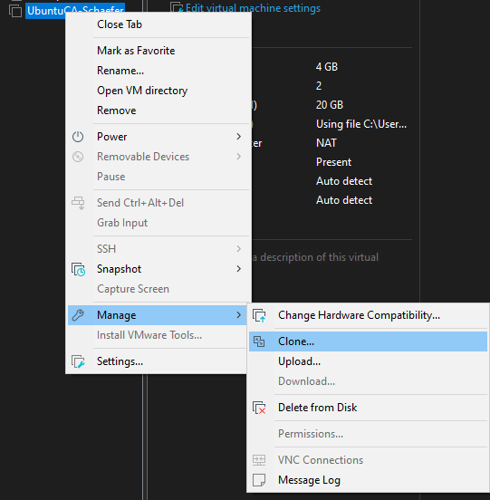
*Figure 2: The simple cloning interface. Just click the button and youre done.*

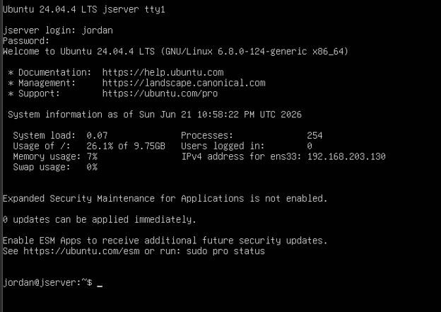
*Figure 3: Complete configuration of the clone*

---

## Part 3: Key Objectives & Lab Instructions

### 3.1 Configuring the Certificate Authority
To establish the certificate authority I first verified that open SSL was installed on the primary Ubuntu machine I then created a rigid directory structure (~/CA) which securely houses the private keys issued certificates and the database files (index.txt, serial). I also generated a 4096 bit RSA private key and used it to self sign the certificate authority's root certificate. One of my critical steps in this process is modifying the /etc/ssl/openssl.cnf file to point to the open SSL application to my specific ~/CA directory and defining the certificate revocation list distribution point.

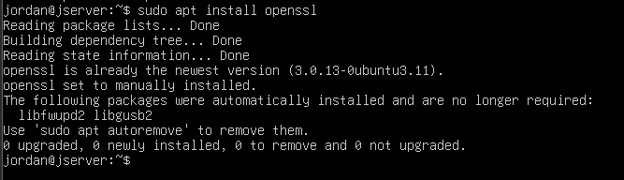
*Figure 4: Installation/Checking for Openssl*

### 3.2 Issuing Certificates
On the web server virtual machine I used the 2048 bit private key and created a certificate signing request (server.csr). A lesson I learned while doing this is the strictness of the open SSL policy match rule if the country state or organization name fields in the CSR do not perfectly match the certificate authority the request is rejected. Even more the common name had no exact match to the server's IP address once correctly generated I used the SCP command to securely transfer the CSR to the certificate authority over SSH. The certificate authority then signed the request resulting in a valid server.crt.

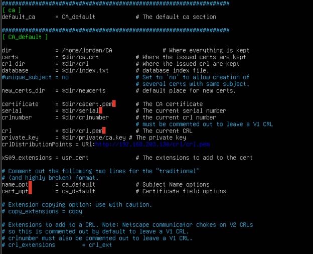
*Figure 5: Configuring CSR details*

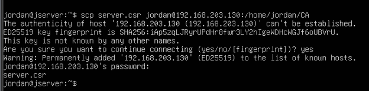
*Figure 6: SCP request*

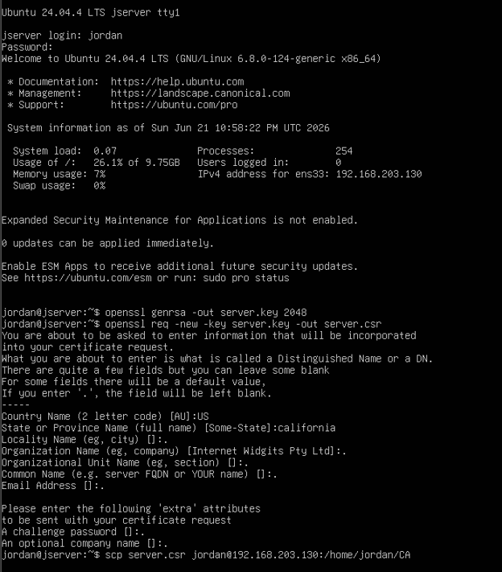
*Figure 7: Generating request for server.csr*

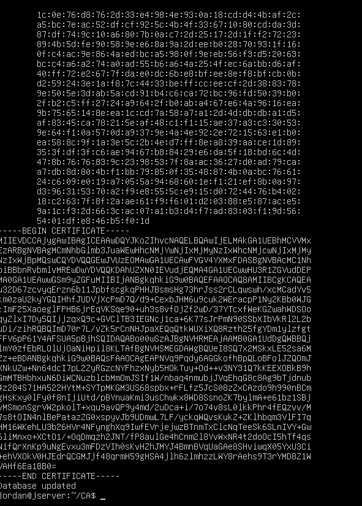
*Figure 8: Completed certificate after signing showing my public certificate*

### 3.3 Setting Up a Webserver with HTTPS
With the certificate successfully being signed I retrieved server.crt from the certificate authority using the SCP command and placed it into the web servers /etc/ssl/certs/ directory using root privileges. I moved the server key into the highly restricted and secure /etc/ssl/certs directory. Then I modified apache's default-ssl.config file to replace the default certificate with the paths to my new files then I enabled the SSL module and restarted the Apache service.

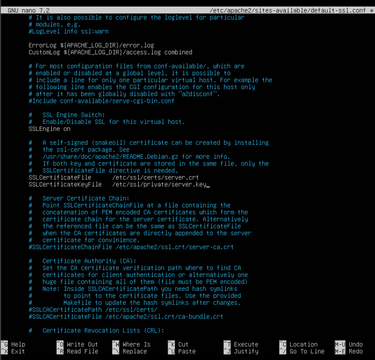
*Figure 9: Nano for editing "snakeoil" values*

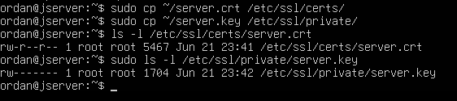
*Figure 10: Proving server.crt and server.key are on WS*

*Figure 11: transfer of server.crt*

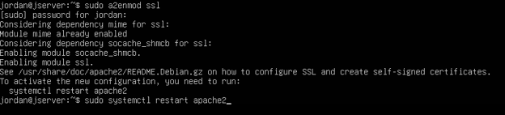
*Figure 12: Restarting the apache service*

### 3.4 Testing Secure Connection
My initial attempts to test the connection resulted in a blank screen here instead of the Apache default screen being shown. I troubleshooted and completely disabled the firewall and the server was still not showing the Apache default screen. The server was securely accepting connections but the Apache web directory lacked an index.html file with anything in it (It is possible apache removed the default screen). So in order to prove that my test was successful I made a test website to host from the web server. I accessed the site using the host machine browser using https://192.168.203.131. Access to be expected with a local certificate authority being assigned to this web page my browser through a connection is not private warning because it was not globally recognized as a valid certificate authority yet. Access the page you simply bypass this warning and you get my page.

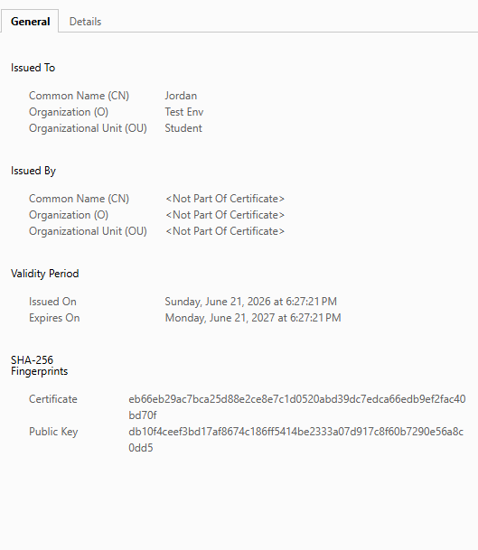
*Figure 13: My certificate*

*Figure 14: My "webpage"*

### 3.5 Revoking Certificates & CRL
The next step of this lab was to simulate a compromised server and revoke the certificate. I did have an initial error occur because the openssl.cnf file defaulted to looking for cacert.pem. I'd bypass this by passing -cert ca.crt and -keyfile private/ca.key flags with the command in the terminal. After using these flags the database successfully marked the certificate as revoked. I then regenerated the crl.pem file and copied it to a newly created /car/www/crl directory on the certificate authorities web server so clients could theoretically access it if need be.

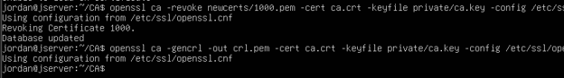
*Figure 15: Revoking Certificate*

### 3.6 Testing Certificate Revocation
In order to test if the revocation was successful was a little bit challenging due to modern web browsers caching certificates statuses and often ignoring updates to CRL's for speed purposes. To bypass this I accessed the site on a freshly started Chrome browser in Incognito mode and the system successfully flagged the connection as insecure due to certificate authority issues demonstrating that the client system recognized that the underlying public key infrastructure was no longer valid. 

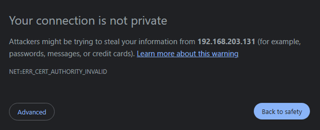
*Figure 16: Authority not valid page*

---

## Collaboration
This lab was completed solely by myself.

---

## Conclusion
What I got from this lab is a deep appreciation for the strictness of digital trust. Through completing this lab I learned that public key infrastructure relies on exact configuration matches and it is a field where a single mismatched common name or organization field will cause the entire chain of trust to fail. I also learned the practical application of Linux file permissions SSH secure copying and Apache virtual host configurations. In the future I will definitely be using these skills to manually secure local development environments and effectively troubleshoot web server encryption failures rather than outsourcing to automated tools.

---

## References
1. Canonical Ltd. "Ubuntu Server Documentation." Ubuntu, https://ubuntu.com/server/docs.
2. The Apache Software Foundation. "Apache HTTP Server Version 2.4 Documentation - SSL/TLS Strong Encryption." Apache.org, https://httpd.apache.org/docs/2.4/ssl/.
3. OpenSSL Software Foundation. "OpenSSL Command Line Utilities." OpenSSL, https://www.openssl.org/docs/man3.0/man1/.
4. Linux manual pages. "scp(1) - Linux manual page." Man7.org, https://man7.org/linux/man-pages/man1/scp.1.html.
5. Canonical Ltd. "UFW - Uncomplicated Firewall." Ubuntu Community Help Wiki, https://help.ubuntu.com/community/UFW.
6. VMware by Broadcom. "Cloning a Virtual Machine." VMware Docs, https://docs.vmware.com/en/VMware-Workstation-Pro/index.html.
